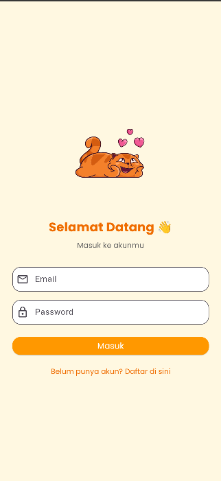

# Bahasaku

**Bahasaku** adalah aplikasi pembelajaran bahasa yang terinspirasi dari Duolingo, dirancang untuk membantu pengguna belajar bahasa dengan cara yang menyenangkan dan interaktif. Aplikasi ini menggunakan pendekatan berbasis misi harian, kuis, dan leaderboard untuk mendorong pengguna terus belajar setiap hari.

## Fitur Utama

* Autentikasi pengguna (Login & Registrasi)
* Kuis interaktif untuk belajar bahasa
* Misi harian yang menantang
* Leaderboard untuk bersaing dengan teman
* Sistem pertemanan (temukan dan tambah teman)
* Notifikasi untuk pengingat belajar
* Profil pengguna dan statistik belajar

## Struktur Proyek (Singkat)

* `lib/screens/` — Berisi tampilan aplikasi (home, login, kuis, dsb.)
* `lib/models/` — Model data (contoh: soal kuis)
* `lib/services/` — Layanan seperti autentikasi, Firestore, dll.
* `lib/widgets/` — Komponen UI yang dapat digunakan ulang
* `lib/utils/` — Utilitas umum (contoh: animasi loader)

## Instalasi & Menjalankan Aplikasi

1. Pastikan sudah menginstal [Flutter](https://flutter.dev/docs/get-started/install).
2. Clone repositori ini:

   ```bash
   git clone https://github.com/username/bahasaku.git
   cd bahasaku
   ```
3. Jalankan perintah berikut untuk menginstal dependensi:

   ```bash
   flutter pub get
   ```
4. Siapkan Firebase:

    * Tambahkan file konfigurasi `google-services.json` (Android) dan `GoogleService-Info.plist` (iOS) sesuai kebutuhan.
    * Edit file `firebase_options.dart` jika diperlukan.
5. Jalankan aplikasi:

   ```bash
   flutter run
   ```

## Cuplikan Layar

Berikut adalah beberapa tampilan dari aplikasi Bahasaku:

### Layar Login



### Layar Beranda


### Layar Profil


## Kontribusi

tentu saja saya dan AI

## Lisensi

Proyek ini belum memiliki lisensi resmi. Jika ingin menggunakan kode ini, mohon hubungi pemilik proyek terlebih dahulu.
